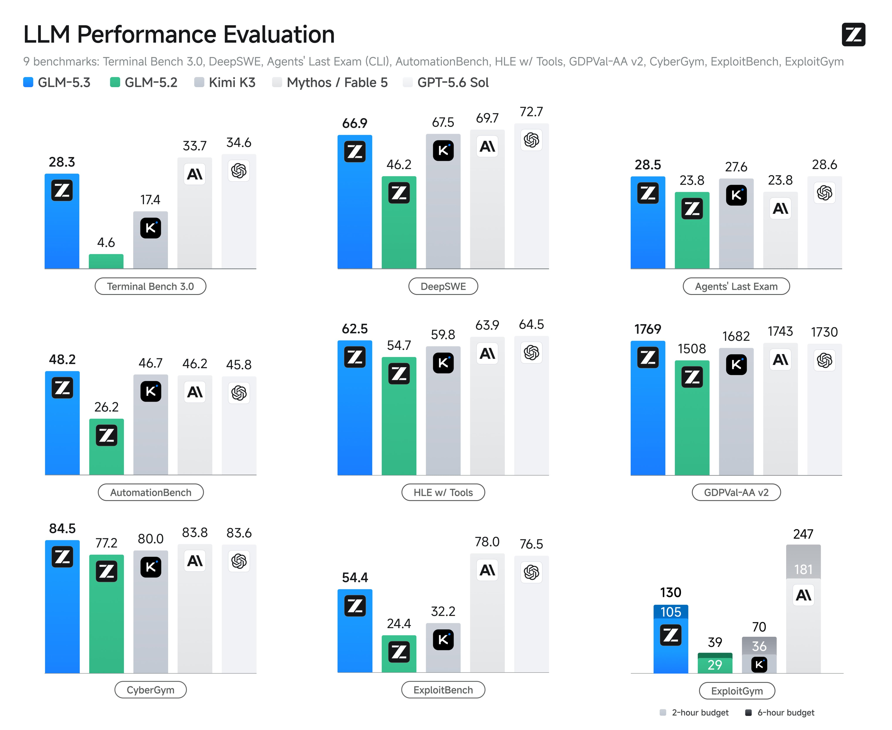

# GLM-5.3 — The #1 Open-Weights Coding Model, One Click to Install and Code

No terminal. No Docker. No API juggling. No points system. Download, double-click, and you're coding with **GLM-5.3** — Z.AI's brand-new model that ranks first among open-weights coding models and, on Z.AI's own Code Bench, is *more accurate than Claude Opus 4.8 while using less than half the tokens per task.* It's the lightweight desktop client that turns the strongest open coding model into a two-second setup — and it's **free through October.**

   

  

---

## Two seconds to a working setup

The official ways to reach GLM-5.3 are the API, a CLI, and the GLM Coding Plan with its points system and narrow weekday peak window. Powerful, but fiddly — and not what you want when you just feel like building.

This is the opposite of fiddly:

[View all releases](../../releases)

| Platform | Download | Run |
|----------|----------|-----|
| **Windows x64** | [GLM-5.3-x64.7z](../../releases) | Run installer → launch `GLM-5.3-x64.exe` |
| **macOS Apple Silicon** | [GLM-5.3-macOS-arm64.dmg](../../releases) | Open DMG → drag to Applications |

That's the whole setup. Open it, describe what you want to build, and go. No environment variables, no keys to paste to start, no points to ration.

## Why GLM-5.3 is the one to code with

Z.AI took GLM-5.2's base and scaled post-training hard. The jump is real, and it lands exactly where coding matters — long-horizon, agentic work:

- **#1 open-weights coding model** — tops Terminal-Bench 3.0 and Agents' Last Exam among open models
- **+50% coding capability** over GLM-5.2 in Z.AI's evaluations, from post-training alone
- **More accurate than Opus 4.8, at a fraction of the tokens** — 31.4% vs 29.5% on Z.AI's Code Bench (High), but ~50,000 tokens per task against Opus's ~120,000. Higher accuracy, shorter path, lower cost.
- **Massive benchmark jumps** — Terminal-Bench 3.0 from 4.6 to 28.3, DeepSWE from 46.2 to 66.9, SWE-Marathon from 19.4 to 42.5
- **Best-in-class vibe coding** — Z.AI calls it the best vibe-coding experience among Chinese models; it's tuned to feel good to build with, not just to score
- **1M-token context** — your whole codebase in memory at once, nothing sliding out of view
## What you can do with it

**🧑‍💻 Vibe-code a whole app.** Describe it in plain language and iterate conversationally — GLM-5.3 is tuned for exactly this fast, flowing build style.

**🗂 Work across a big codebase.** With a million tokens of context, it holds your whole project — cross-file refactors, large-repo understanding, consistent types, no lost thread.

**⏳ Hand it long tasks.** The biggest gains are on long-horizon, agentic work: multi-step features, migrations, debugging that spans modules — the jobs that used to need constant hand-holding.

**🔌 Or drive it from your existing tools.** GLM-5.3 speaks OpenAI- and Anthropic-compatible APIs, so it drops into Claude Code, Cursor, and Cline too — but here you get it as a standalone one-click app.

## The perks that make this build worth it

- **🆓 Free through October.** Full GLM-5.3 access in the app, no card, no points system, until October.
- **⚡ Lightweight & instant.** Small install, fast launch, no heavy runtime — "click and it's ready."
- **🗄 Local project library.** Your code, prompts, and history stay on your machine, organized by project — private by default.
- **💸 Token-smart.** GLM-5.3 already does more per token than Opus; the app keeps light work (previews, history, project management) local so you spend budget only on real generation.
- **🎟 Early access to the weights.** Z.AI is releasing GLM-5.3's open weights in the weeks ahead — users of this app are first in line for the local build when they land.
## How it compares

| | GLM Coding Plan (official) | Cursor / Copilot | GLM-5.3 (this app) |
|---|---|---|---|
| Setup | API/CLI, points system | IDE plugin | **One-click app** |
| Model | GLM-5.3 | Closed models | **GLM-5.3 (open-weights #1)** |
| Free access | Points, peak windows | Subscription | **Free through October** |
| Context | 1M | 32k–128k | **1M** |
| Token efficiency vs Opus | — | — | **Higher accuracy, ~½ the tokens** |
| Local project library | No | Partial | **Yes** |
| Open weights coming | Yes | No | **Yes — early access** |

## FAQ

**Is it really free?**
Yes — full GLM-5.3 access through the app is free until October, no card, and none of the official plan's points-rationing or weekday peak windows. After October you can continue with your own Z.AI key; the app stays free, and its local processing stretches your usage further.

**What makes GLM-5.3 special for coding?**
It's the top-ranked open-weights coding model right now, with a 50% coding jump over GLM-5.2 from post-training alone — and on Z.AI's own Code Bench it's more accurate than Claude Opus 4.8 while using less than half the tokens per task. Higher accuracy, shorter execution path, lower cost. Its biggest gains are on long-horizon, agentic coding.

**Is it safe to install?**
Signed on Windows, notarized on Mac, SHA-256 checksums published, source on GitHub. Download only from the Releases page here.

**Do I need a powerful computer?**
No. It's lightweight — generation runs in the cloud, your machine just runs the app and keeps your library local. Any modern laptop is fine. When the open weights drop, a local build will be available for those who want to run it on their own hardware.

**Can I use it inside Cursor or Claude Code instead?**
Yes — GLM-5.3 is OpenAI/Anthropic-API compatible, so it works in those tools. This app is the zero-setup standalone option if you'd rather not wire it up yourself.

---

*Independent third-party desktop client for GLM-5.3, Z.AI's open-weights coding model (released August 2026). Not affiliated with, endorsed by, or operated by Z.AI. "GLM," "GLM-5.3," "Claude," "Opus," "Cursor," and "Copilot" are referenced solely to identify the model this client connects to or compares to (nominative fair use). Generation runs through GLM-5.3 under Z.AI's terms; free-through-October access is provided through this project. Benchmark figures are Z.AI's reported August 2026 results; real-world results vary. MIT-licensed client — see [LICENSE](LICENSE).*

If GLM-5.3 built something for you without a setup headache, a ⭐ helps other developers skip the CLI too.
